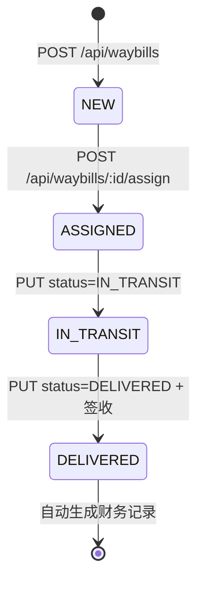
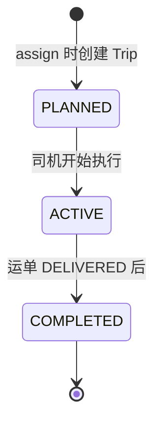

# TMS 运输业务闭环 – 状态机视图

本文档描述集成测试脚本覆盖的业务路径与运单/行程状态流转。脚本对齐 **TMS_TESTING_PLAN.md v1.0**，覆盖六大信息流、14 项测试目标、18+ 个 API 用例。

---

## 1. 运单 (Waybill) 状态机

### 文本视图

```
                    ┌─────────┐
                    │  NEW    │  ← 创建运单 POST /api/waybills
                    └────┬────┘
                         │
                         │  POST /api/waybills/:id/assign
                         │  (driver_id, vehicle_id)
                         ▼
                    ┌──────────┐
                    │ ASSIGNED │  ← 已分配司机与车辆，生成 Trip
                    └────┬─────┘
                         │
                         │  PUT /api/waybills/:id  status=IN_TRANSIT
                         ▼
                    ┌─────────────┐
                    │ IN_TRANSIT  │  ← 运输中
                    └──────┬──────┘
                           │
                           │  PUT /api/waybills/:id  status=DELIVERED
                           │  (signed_by, signed_at, signature_url)
                           ▼
                    ┌───────────┐
                    │ DELIVERED │  ← 签收回单完成
                    └───────────┘
                           │
                           │  后端自动创建：应收 (receivable) + 司机应付 (payable)
                           ▼
                    [财务记录已生成]
```

### Mermaid 图



---

## 2. 行程 (Trip) 状态机（与运单关联）

### 文本视图

```
                    ┌─────────┐
                    │ PLANNED │  ← 分配运单时创建 Trip
                    └────┬────┘
                         │
                         │  (业务上：司机开始执行 → 运单 IN_TRANSIT)
                         ▼
                    ┌─────────┐
                    │ ACTIVE  │  ← 可选：PUT /api/trips/:id 更新状态
                    └────┬────┘
                         │
                         │  运单 DELIVERED 后行程可标记完成
                         ▼
                    ┌───────────┐
                    │ COMPLETED │
                    └───────────┘
```

### Mermaid 图



---

## 3. 集成测试业务路径（对齐 TMS_TESTING_PLAN 14 项 + P0）

### 3.1 单步场景（18+）

| 计划章节 | 场景 | API / 行为 | 断言要点 |
|----------|------|------------|----------|
| §1 | 1.1 创建运单-必填与写入 | POST /api/waybills | status=NEW, id/waybill_no |
| §1 | 1.2 Amazon 风格字段 | POST /api/waybills (fulfillment_center, delivery_date 等) | 201/200 |
| §1 | 1.3 写入并校验读写一致 | POST + GET /api/waybills/:id | 读写一致 |
| §2 | 2.1 运费-客户报价 | POST /api/pricing/calculate | totalRevenue |
| §2 | 2.2 司机薪酬预览 | POST /api/rules/preview-pay | totalPay |
| §3 | 3.1 运单指派 | POST /api/waybills/:id/assign | waybill.status=ASSIGNED, trip_id |
| §5 | 5.1 运单列表与筛选 | GET /api/waybills?status= | 列表与筛选 |
| §5 | 5.2 运单搜索 | GET /api/waybills?search= | 搜索返回 |
| §5 | 5.3 运单更新-状态流转 | PUT /api/waybills/:id (status=IN_TRANSIT) | waybill.status=IN_TRANSIT |
| §6 | 6.1 行程 Tracking | GET /api/trips/:id/tracking | waybills, driver |
| §6 | 6.2 行程消息 | POST/GET /api/trips/:id/messages | 消息发送与列表 |
| §6 | 6.3 行程事件 | POST /api/trips/:id/events | 事件记录 |
| §7–8 | 7.1 司机列表 / 8.1 车辆列表 | GET /api/drivers, GET /api/vehicles | data/total |
| §9 | 9.1 签收回单 | PUT waybill DELIVERED + signed_* | status=DELIVERED |
| §12–13 | 12.1 应付 / 13.1 应收 / Dashboard | GET /api/finance/records, /dashboard | 记录条数 / 指标 |
| §14 | 14.1 登录 / 14.2 受保护接口 | POST /api/auth/login, GET /api/finance/dashboard | token / 200 或 401 |

### 3.2 P0 完整闭环（6 步 × N 组并发）

| 步骤 | 描述 | API | 断言 |
|------|------|-----|------|
| P0-1 | 创建运单 | POST /api/waybills | id, status=NEW |
| P0-2 | 智能调度 | POST /api/waybills/:id/assign | ASSIGNED, trip_id |
| P0-3 | 运输开始 | PUT status=IN_TRANSIT | IN_TRANSIT |
| P0-4 | 异常/事件(可选) | POST trips/:id/messages, events | 可选 |
| P0-5 | 签收回单 | PUT status=DELIVERED + 签收字段 | DELIVERED |
| P0-6 | 财务结算 | GET /api/finance/records | 存在该 waybill 的应收 |

---

## 4. 数据流与 ID 传递

```
  order_id (waybill_id)  ──►  assign  ──►  trip_id
         │                        │
         │                        └──► 用于 Step 4 发消息
         │
         └──► 用于 Step 3 / 5 更新运单
         └──► 用于 Step 6 查询财务记录 (shipment_id)
```

脚本内自动从前一步响应中提取 `id`、`waybill_no`、`trip.id` 等，并传入下一步请求。

---

## 5. 如何运行集成测试

在项目根目录或 `apps/backend` 下执行：

```bash
cd apps/backend
npm install
npm run test:integration
```

或直接使用 ts-node：

```bash
cd apps/backend
npx ts-node scripts/tms-lifecycle-integration.ts
```

**环境变量（可选）：**

- `TMS_API_BASE_URL`：后端 API 基地址，默认 `http://localhost:3001`
- `TMS_TEST_CONCURRENCY`：并发跑几条闭环，默认 `10`
- `TMS_TEST_USER` / `TMS_TEST_PASSWORD`：登录账号，用于 Step 2（调度）和 Step 6（财务）；默认 `tom@tms.com` / `dispatcher123`（需数据库中存在该用户且可登录）

运行前请确保：

1. **后端服务已启动**：在 `apps/backend` 下执行 `npm run dev`（默认 `http://localhost:3001`）。
2. **数据库已迁移**：执行 `npm run migrate`（并确保存在至少一名 IDLE 司机与一辆 IDLE 车辆，以及可选测试用户用于 Step 2/6）。
3. **并发说明**：默认 10 条闭环同时跑；若数据库仅有个别 IDLE 司机/车辆，可设置 `TMS_TEST_CONCURRENCY=1` 或 `3` 避免 Step 2 冲突。
