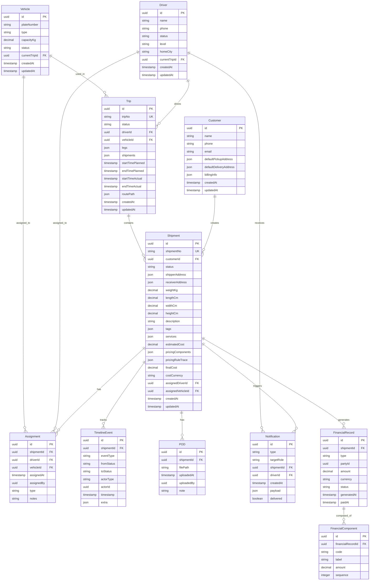

# TMS系统ER图 (Mermaid)

## 实体说明

### 核心实体
- **Customer**: 客户信息，包含默认地址
- **Shipment**: 运单主表，包含状态和费用信息
- **Driver**: 司机信息，包含当前状态和行程
- **Vehicle**: 车辆信息，包含载重和状态
- **Trip**: 行程表，支持多运单挂载

### 关联实体
- **Assignment**: 指派记录，记录运单与司机/车辆的关联
- **TimelineEvent**: 时间线事件，记录状态变更历史
- **POD**: 签收凭证，存储上传的图片
- **Notification**: 通知记录，支持多种通知类型

### 财务实体
- **FinancialRecord**: 财务记录，应收/应付
- **FinancialComponent**: 财务组件，费用分解

## 关键关系
1. 一个客户可以有多个运单
2. 一个运单可以指派给一个司机和一辆车
3. 一个行程可以包含多个运单（联程/多段）
4. 一个司机/车辆在特定时间只能属于一个行程
5. 运单状态变更会生成时间线事件
6. 运单完成会生成财务记录

<!-- Added by assistant @ 2025-09-29 09:12:36 15:30:00 -->
