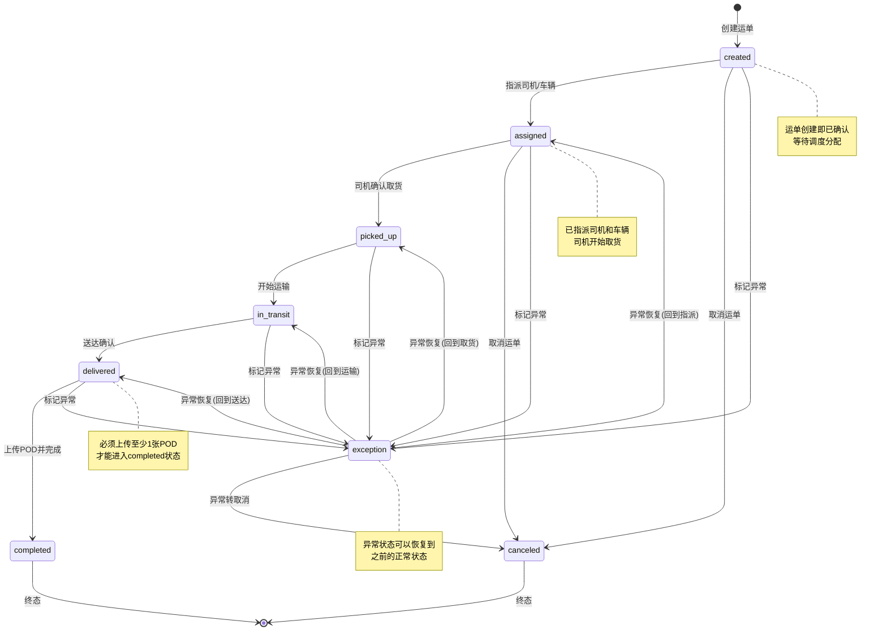
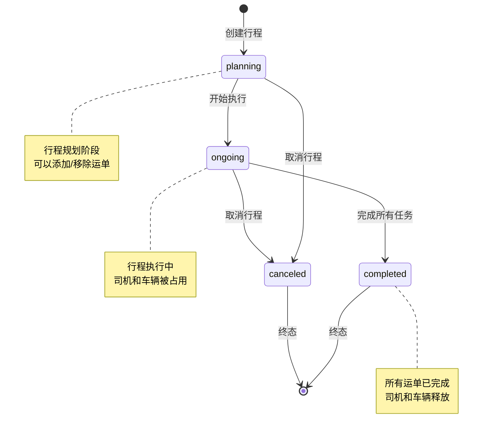
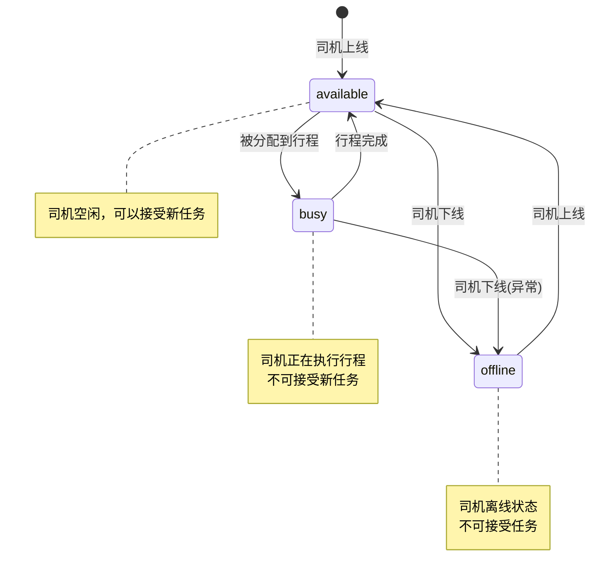
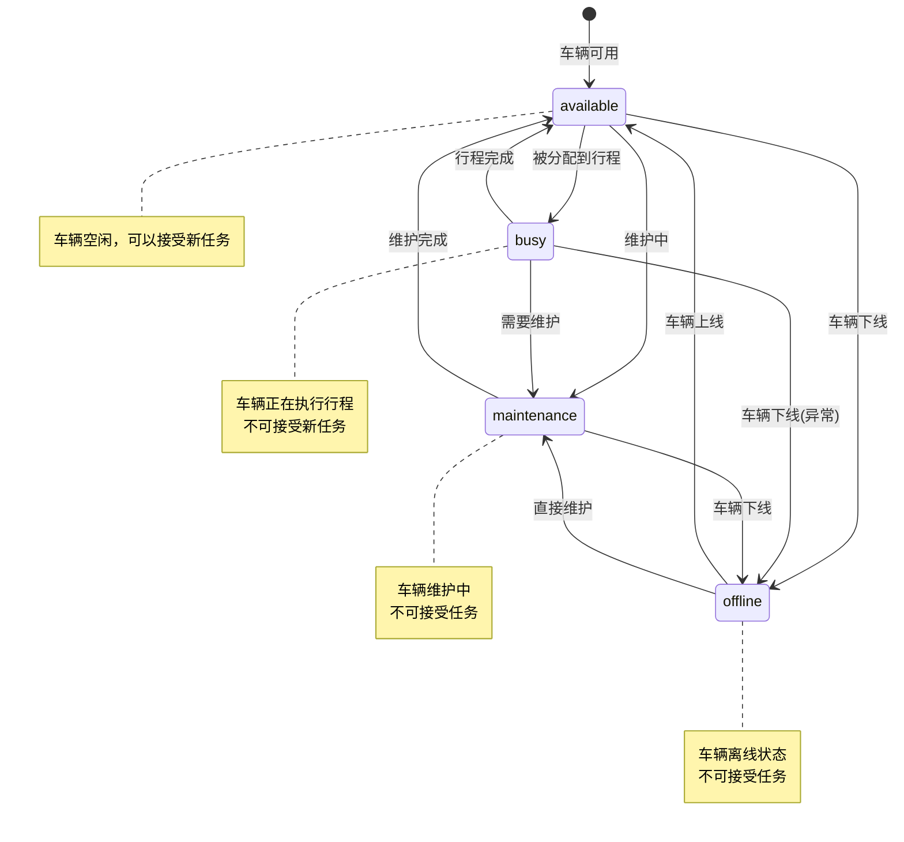

# TMS系统状态机图 (Mermaid)

## 运单状态机

## 行程状态机

## 司机状态机

## 车辆状态机

## 状态转换规则

### 运单状态转换规则
1. **created → assigned**: 必须指定司机和车辆，且司机和车辆状态为available
2. **assigned → picked_up**: 司机确认取货，自动记录时间戳
3. **picked_up → in_transit**: 开始运输，可以合并到取货确认
4. **in_transit → delivered**: 司机确认送达
5. **delivered → completed**: 必须上传至少1张POD，且finalCost已填写
6. **任意状态 → exception**: 标记异常，需要填写异常类型和描述
7. **exception → 正常状态**: 异常恢复，需要填写解决方案

### 行程状态转换规则
1. **planning → ongoing**: 行程开始执行，司机和车辆状态变为busy
2. **ongoing → completed**: 所有挂载的运单都已完成
3. **任意状态 → canceled**: 取消行程，释放司机和车辆

### 司机/车辆状态转换规则
1. **available → busy**: 被分配到行程时自动转换
2. **busy → available**: 行程完成时自动转换
3. **任意状态 → offline**: 手动下线或异常情况
4. **offline → available**: 重新上线

## 状态校验规则

### 运单状态校验
- 状态转换必须按照合法顺序进行
- 非法状态转换返回409错误
- delivered→completed前必须上传POD
- assigned前司机和车辆必须为available状态
- 分配后司机和车辆自动变为busy状态

### 行程状态校验
- 一个司机+车辆在特定时间只能属于一个行程
- 行程中的运单状态变更会触发相应的事件
- 行程完成时所有运单必须处于completed状态

### 数据一致性校验
- 状态变更会记录到timeline表
- 状态变更会生成相应的通知
- 财务记录在运单completed时自动生成

<!-- Added by assistant @ 2025-01-27 15:30:00 -->
